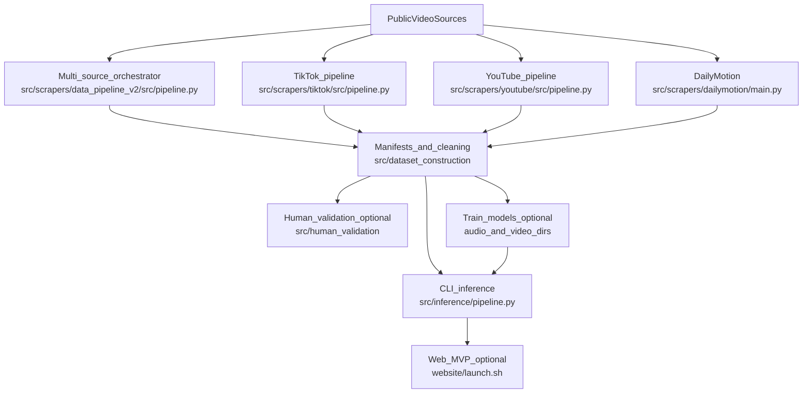

# Cats in Pain — Bachelors Thesis Repository

End-to-end research codebase for **collecting, labeling, and modeling cat pain and emotion** from public videos: scraping and filtering candidates, building manifests, training audio/video/pose models, running **CLI inference**, and an optional **local-first web MVP** around the same inference pipeline.

**Quick links:** [Inference CLI](src/inference/README.md) · [Web MVP](website/README.md) · [Data pipeline v2](src/scrapers/data_pipeline_v2/README.md) · [Dataset construction](src/dataset_construction/README.md) · [Quickstart](docs/quickstart.md) · [Script index](docs/script-index.md)

## Pipeline overview

High-level flow (see sub-READMEs for flags, env vars, and artifacts):



**Legend:** `Train_models_optional` covers experiments under `audio/`, `video/cnn-finetuning/`, `video/pose-models/`, etc. `Web_MVP_optional` is FastAPI + worker + Vite UI; inference alone does not require it.

## Quick start

From the **repository root** (required so `REPO_ROOT` / relative paths resolve).

1. **Install baseline Python deps** (see [Requirements](#requirements)).
2. **Inference on one clip** → [src/inference/README.md](src/inference/README.md):
   ```bash
   python src/inference/pipeline.py --video path/to/clip.mp4
   ```
3. **Full onboarding** (data pipeline, web stack, Postgres) → [docs/quickstart.md](docs/quickstart.md).

## Requirements

- **Python:** **3.10+** for most CLIs and training paths; **3.11+ recommended** for the [website](website/README.md) stack (FastAPI worker + frontend tooling).
- **`ffmpeg` / `ffprobe`** on `PATH` (inference, scraping, video processing).
- **Layered installs:** start with [requirements.txt](requirements.txt), then add per-subproject files as needed (YAMNet stack, scrapers, web layer). See [docs/quickstart.md](docs/quickstart.md) for a minimal sequence.

```bash
pip install -r requirements.txt
pip install -r audio/audio-pre-classifier/requirements.txt   # YAMNet (torch-audioset)
pip install -r src/scrapers/data_pipeline_v2/requirements.txt
```

**Audio branch of inference** (AudioSep / extra deps) is not covered by the root `requirements.txt`:

```bash
pip install -r src/inference/requirements-audiosep.txt
```

## Data collection

| Workflow | Command |
|----------|---------|
| Multi-source orchestrator (recommended) | `python src/scrapers/data_pipeline_v2/src/pipeline.py --config src/scrapers/data_pipeline_v2/config/pipeline.yaml` |
| TikTok | `python src/scrapers/tiktok/src/pipeline.py --config src/scrapers/tiktok/config/pipeline.yaml` |
| YouTube | `python src/scrapers/youtube/src/pipeline.py --config src/scrapers/youtube/config/pipeline.yaml` |
| Dailymotion | `python src/scrapers/dailymotion/main.py --config src/scrapers/dailymotion/config/pipeline.yaml` |

Env keys for GPT / YouTube API (optional) are documented in [src/scrapers/data_pipeline_v2/README.md](src/scrapers/data_pipeline_v2/README.md).

## Dataset construction

Sequential manifests under `src/dataset_construction/manifests/` (see [src/dataset_construction/README.md](src/dataset_construction/README.md)).

| Step | Command |
|------|---------|
| 00 merge metadata | `python src/dataset_construction/00_merge_metadata.py` |
| 01 static detection | `python src/dataset_construction/01_static_detection.py` |
| 02 GPT description | `python src/dataset_construction/02_gpt_description.py` |
| 03 cat ID | `python src/dataset_construction/03_cat_id.py` |
| 04 audio emotion (separated audios) | `python audio/audio-emotion-classifier/inference/04_audio_classification.py` |
| 05 final dataset | `python src/dataset_construction/05_final_dataset.py` |

Run **02** (GPT descriptions → `metadata_clean_02.jsonl`) before **03** (cat ID → `metadata_clean_03.jsonl`) unless you change defaults in `src/dataset_construction/config.yaml`.

Step **04 → manifest merge** into `metadata_clean_04.jsonl` is called out as **not fully wired** in the dataset README; place or produce `metadata_clean_04.jsonl` before step 05 as documented there.

## Inference

| Task | Command |
|------|---------|
| End-to-end video inference | `python src/inference/pipeline.py --video path/to/clip.mp4` |
| Sliding windows | `python src/inference/pipeline.py --video path/to/clip.mp4 --split-window-sec 6 --split-step-sec 3` |

Outputs land under `runs/inference/<run_id>/` (`pipeline_result.json`, `timing.json`, etc.). Details: [src/inference/README.md](src/inference/README.md).

## Website (local-first MVP)

| Task | Command |
|------|---------|
| One terminal (API + worker + Vite) | From repo root: `bash website/launch.sh` |
| First-time deps | From repo root: `bash website/launch.sh --install-deps` (or `cd website && make up`) |
| Docker Compose | From `website/`: `docker compose up --build` |

Prerequisites (Node, Postgres, `.env`): [website/README.md](website/README.md).

## Training and analysis (advanced)

| Task | Command |
|------|---------|
| YAMNet cat-prob evaluation | `python audio/audio-pre-classifier/src/evaluate_v2_data.py --help` |
| 10-class cat emotion inference | `python audio/audio-emotion-classifier/inference/04_audio_classification.py --help` |
| EfficientNet-B3 finetune | `python video/cnn-finetuning/src/train.py --config video/cnn-finetuning/config/default.yaml` |
| ViTPose extraction | `python video/easyViTPose/extraction/06_pose_extraction.py --help` |
| DeepLabCut SuperAnimal extraction | `python video/deep-lab-cut/extraction/06_pose_extraction_superanimal.py --help` |
| ST-GCN training (pose-models) | `python video/pose-models/run_stgcn_deeplabcut_train.py --config video/pose-models/config_stgcn_dlc.yaml` |
| GPT vision LLM eval (FGS) | `jupyter notebook video/gpt-fgs/cat_pain_llm_eval.ipynb` |

## Layout

```
.
├── audio/
│   ├── audio-pre-classifier/        YAMNet (PyTorch) cat / non-cat gating (active)
│   └── audio-emotion-classifier/    10-class CatEmotionModel (PANN Cnn14 backbone)
├── video/
│   ├── gpt-fgs/                     GPT vision evaluation against the Feline Grimace Scale
│   ├── cnn-finetuning/              EfficientNet-B3 cropped-cat finetune
│   ├── easyViTPose/                 ViTPose pose extraction (incl. 06_pose_extraction.py)
│   ├── deep-lab-cut/                DeepLabCut SuperAnimal-Quadruped extraction & inference
│   └── pose-models/                 Pose-based classifiers (P0..P4 + ST-GCN; ST-GCN headline)
├── src/
│   ├── scrapers/
│   │   ├── tiktok/                  TikTok candidate scraper + filter + downloader
│   │   ├── youtube/                 YouTube scraper
│   │   ├── dailymotion/             DailyMotion scraper
│   │   └── data_pipeline_v2/        Multi-source orchestrator (default audio backend: YAMNet v3)
│   ├── dataset_construction/        Cleaning + labeling pipeline (numbered steps + manifests)
│   ├── human_validation/            Gradio app + GPT description scripts for human-in-the-loop
│   ├── inference/                   End-to-end CLI inference on a single video
│   ├── utils/
│   │   └── pipeline_helpers/        Shared class-name + persistence helpers
│   └── scripts/                     Cross-cutting utility scripts (frame extraction, crops, …)
├── website/                         FastAPI + worker + React/Vite MVP
├── runs/                            Consolidated experiment outputs grouped by subproject
│   ├── pose-models/
│   ├── cnn-finetuning/
│   ├── audio-pre-classifier/
│   ├── data-pipeline-v2/
│   ├── tiktok-pipeline/
│   ├── dailymotion/
│   └── gpt-fgs/                     LLM eval predictions + reports
├── models/                          Checkpoints (git-ignored except README)
│   ├── yolo/                        yolo11m, yolov8l/m/x.pt
│   ├── audio_emotions/              CatEmotionModel best_model_final.pth + intermediates
│   └── pose_est/                    ViTPose-H (apt36k) weights
├── data/                            All training data (git-ignored except README)
│   ├── dataset/                     Snippets, downsampled videos, full frames, manifests, DLC h5
│   ├── audio_cat-classification/    NAYA / Catmood raw audio
│   ├── audio_preclassification/     ESC-50, AudioSet, etc.
│   ├── video-data/                  Misc raw video collections
│   └── img_examples/
├── docs/                            Short GitHub-facing guides (quickstart, script index)
├── logs/                            Pipeline runtime logs (kept in git)
└── _archive/                        Deprecated code & data (kept for review, never published)
    ├── top_level_scripts/           V1 training scripts (binary_classifier, supcon, …)
    ├── top_level_notebooks/         Old analysis & training notebooks
    ├── audio_preclassifier_v2/      Legacy sklearn audio preclassifier
    ├── audio_progress/              Old training intermediate dumps
    ├── audio_progress_3/            (same)
    ├── audio_separation_checkpoints/ Old crm/u-net checkpoints + voting classifier
    ├── old_runs/                    V1 training run dirs
    ├── old_metadata_files/          Legacy *.jsonl / *.json metadata
    ├── plots/                       Stand-alone PNGs / SVGs
    ├── separated/                   Old separated-audio dump
    └── misc/                        cloud/, deploy/, tools/, snippet_analytics, downloads/, …
```

## Models / data prerequisites

Heavy artifacts are **not** in git ([`.gitignore`](.gitignore)). Place files yourself following the layout above. The active code references:

- `models/yolo/yolov8x.pt`, `models/yolo/yolo11m.pt` (data_pipeline_v2 + dataset_construction)
- `models/audio_emotions/best_model_final.pth` (audio-emotion-classifier)
- `models/pose_est/vitpose-h-apt36k.pth` (easyViTPose extraction)
- `audio/audio-emotion-classifier/src/audio_classifier_utils/pretrained_weights/Cnn14_16k_mAP=0.438.pth` (PANN backbone)
- `data/dataset/snippets_v2/`, `data/dataset/tiktok_snippets/`, `data/dataset/deeplabcut_really_labeled/`, …
- Manifests under `src/dataset_construction/manifests/` (canonical `final_dataset_v2.jsonl` after step 05)

Inference default weights and stack paths are listed in [src/inference/README.md](src/inference/README.md).

## Archive policy

Files under `_archive/` are **kept** as a safety net during the restructure. They are git-ignored and not part of the active import graph. Nothing under `_archive/` is required to run the pipelines listed above.

## Data policy: non-destructive workflows

Pipeline steps should **not** delete raw dataset assets as a way to “fix” data. Prefer new manifest versions, reports, or flags. The full rule for this repo: [`.cursor/rules/never-delete-data.mdc`](.cursor/rules/never-delete-data.mdc) — in short: **never delete raw data or assets** as routine pipeline cleanup; prefer manifests, flags, or archival moves unless you explicitly intend destructive removal.
