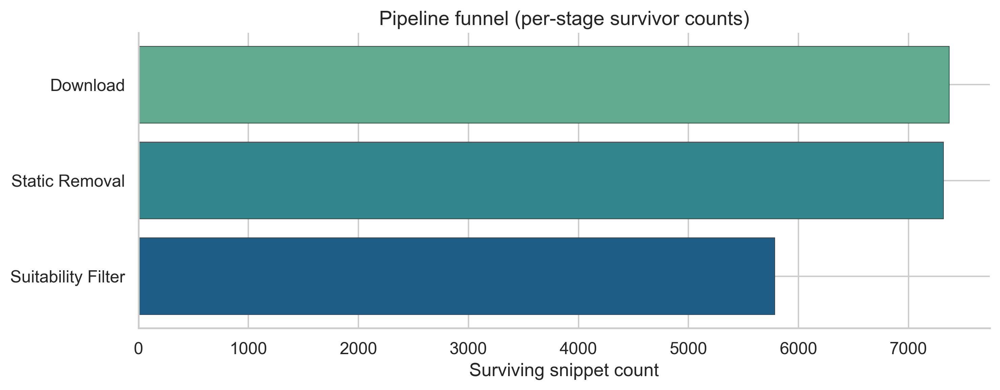

# Cats in Pain — thesis research repository

**Public-video corpus, cross-modal weak labels, and appearance-free pose dynamics for studying pain-related behavioral signals in cats** — with runnable inference and an optional local web MVP.

[](https://example.com/thesis-pdf-todo)
[](https://example.com/dataset-todo)
[](https://github.com/vwicky/cats-in-pain-main)
[](https://github.com/vwicky/cats-in-pain-main)
[]()

**Links:** [Paper PDF](https://example.com/thesis-pdf-todo) · [Dataset](https://example.com/dataset-todo) · [Inference CLI](src/inference/README.md) · [Web MVP](website/README.md) · [Quickstart](docs/quickstart.md)

---

This repository provides **data, models, and code** for an end-to-end **public social-media video pipeline**: from collection and filtering through manifest-driven labeling (including **audio-derived pseudo-labels**) to modeling and a single-clip inference CLI.

It targets **preliminary evidence** on **emotional and behavioral state** and **pain-related signals** using **weak supervision**, not clinical ground truth.

## Results snapshot

- **~7,318** short-form cat video snippets in the canonical merged manifest used for thesis figures (see `src/dataset_construction/paper_figures/output_pngs/figure_report.txt` when generated).
- **10-class** vocal-behavior taxonomy from **audio-derived pseudo-labels** (`audio_label_10`).
- **Appearance-free pose dynamics** with spatio-temporal graph modeling (**ST-GCN** headline path) and **pairwise** pose classifiers.
- Example pairwise head (**Paining** vs **Resting**): **macro F1 ≈ 0.761**, **ROC AUC ≈ 0.821** on the validation split reported in `src/dataset_construction/reports/video_pipeline_comprehensive_report.txt` (single cited run).
- **Preliminary research results — not clinically validated.**

## Why this work matters

Cheap, scalable video from the open web makes it possible to study subtle behaviors at scale, but expert labels are scarce.

This project builds a **cross-modal dataset** that ties each snippet to automated quality metadata and **audio-derived pseudo-labels**, then pushes the **primary** research thread toward **appearance-free pose dynamics** so the video pathway focuses on how the cat moves, not static RGB appearance.

**Secondary** tracks include vision finetuning, GPT–Feline Grimace Scale–style scoring, and pose extraction baselines; **operational** components cover scraping, manifests, and deployment-minded inference.

None of this substitutes for veterinary assessment; it is **not a clinical validation study**.

<p align="center">
  
</p>

<p align="center"><em>Pipeline funnel (manifest-driven survivor counts). Regenerate via <code>python src/dataset_construction/paper_figures/generate_plots.py</code>; copy for the README lives in <code>docs/readme_assets/</code>.</em></p>

## What’s in this repository

- **Data pipeline** — Multi-platform collection, filtering, and downloads into a snippet corpus; sequential manifests for cleaning, GPT-assisted screening, and merges ([data pipeline v2](src/scrapers/data_pipeline_v2/README.md), [dataset construction](src/dataset_construction/README.md)).
- **Models** — Audio pseudo-labeling, pose sequences, ST-GCN / pairwise pose heads, and comparative baselines; details and commands are summarized in [docs/research-overview.md](docs/research-overview.md) and [docs/training-and-analysis.md](docs/training-and-analysis.md).
- **Inference and web MVP** — One-command CLI on a local clip ([inference](src/inference/README.md)); optional FastAPI + worker + UI ([website](website/README.md)).

## Quickstart

Work from the **repository root** so relative paths resolve.

**Minimal install (video inference path):**

```bash
pip install -r requirements.txt
pip install -r audio/audio-pre-classifier/requirements.txt
```

**Run inference on one clip:**

```bash
python src/inference/pipeline.py --video path/to/clip.mp4
```

**Tested stack (orienting numbers):** Python **3.10+** for most CLIs and training; **3.11+** recommended for the web stack; **`ffmpeg` / `ffprobe`** on `PATH`; optional audio branch deps in `src/inference/requirements-audiosep.txt`.

Full sequences (scraping, manifests, Postgres, Docker): [docs/quickstart.md](docs/quickstart.md). **Artifact paths** for weights and data: [src/inference/README.md](src/inference/README.md), [models/README.md](models/README.md), [data/README.md](data/README.md).

## Reproducibility philosophy

The repo is **manifest-driven** and **non-destructive**: new stages write manifests, annotations, and reports instead of mutating raw collected media in place whenever avoidable.

That keeps weakly supervised iterations auditable and aligns with preservation-oriented research engineering.

**Details:** [docs/repository-layout.md](docs/repository-layout.md) · [docs/data-and-archive-policy.md](docs/data-and-archive-policy.md) · [`.cursor/rules/never-delete-data.mdc`](.cursor/rules/never-delete-data.mdc)

## Project status

This repository accompanies **bachelor thesis research**. The codebase is **usable** but still subject to cleanup and consolidation; some experimental paths remain under `_archive/` for reproducibility and are not part of the default workflows.

Treat the stack as **research software**, not a polished clinical or consumer product.

## Ethics and limitations

- Labels are **pseudo-labels** and **weak supervision** outputs; expect **noise**, imbalance, and domain shift relative to clinical or controlled settings.
- **Public social-media video** raises consent, representation, and platform-policy issues; conclusions apply to **online content**, not to a representative cat population in care.
- **No clinical validation** is claimed; do **not** use outputs for diagnosis or treatment decisions.

## Citation

If you use this repository or the associated thesis, please cite both the **thesis / paper** (when published) and the **codebase**.

**Preferred citation (fill placeholders when the thesis is public):**

> TODO Author (TODO Year). *TODO Full thesis title.* TODO institution / department.  
> Software: `vwicky/cats-in-pain-main` — https://github.com/vwicky/cats-in-pain-main

**BibTeX (template):**

```bibtex
@mastersthesis{todo2026cats,
  author  = {TODO},
  title   = {TODO: Full Thesis Title},
  school  = {TODO University},
  year    = {TODO},
  url     = {https://example.com/thesis-pdf-todo},
  note    = {Companion code: https://github.com/vwicky/cats-in-pain-main}
}
```

## Further documentation

- [Research overview](docs/research-overview.md) — methodology, model hierarchy, results context  
- [Quickstart](docs/quickstart.md) — installs, pipeline replay, web stack  
- [Script index](docs/script-index.md) — task → command  
- [Training and analysis](docs/training-and-analysis.md) — advanced training entrypoints  
- [Repository layout](docs/repository-layout.md) — full tree  
- [Inference CLI](src/inference/README.md) · [Dataset construction](src/dataset_construction/README.md) · [Human validation](src/human_validation/) · [Website](website/README.md)  
